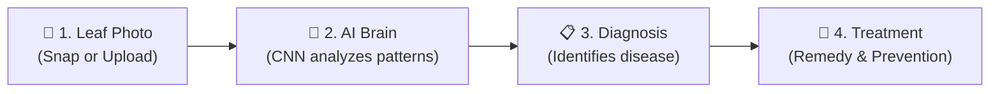

# FarmAssist: Complete Project Guide in Simple Words

Welcome to **FarmAssist**! This guide explains what the project is, why it was created, how it works, and how all its pieces fit together — in simple, everyday language without confusing technical jargon.

---

## 1. What is FarmAssist in One Minute?

Imagine having an expert plant doctor right in your pocket. 

When a farmer or home gardener notices brown spots, yellowing leaves, or strange curled edges on their crops, they usually have to guess what is wrong or wait days for an agricultural expert to visit.

With **FarmAssist**, all you do is:
1. **Take a photo** of the sick leaf with your phone or laptop camera (or upload an image).
2. **Click "Run AI Diagnosis"**.
3. Within 1 second, FarmAssist tells you:
   - What crop it is (e.g., *Tomato* or *Potato*).
   - Exactly what disease it has (or confirms if the leaf is 100% healthy).
   - What caused it and how severe it is.
   - What exact organic sprays, medicines, or fertilizers to use to save the harvest.
   - Clear advice in **English, Kannada (ಕನ್ನಡ), or Hindi (हिन्दी)**.
   - Full **hands-free voice commands** so you can talk to the app even with muddy hands in the field.

---

## 2. Why Did We Build This? (The Real Problem)

Farmers feed the world, but crop diseases destroy up to **40% of global harvests every year**. 

* **The Problem**:
  - Most diseases (fungus, bacteria, viruses) look very similar to the naked eye.
  - Farmers often buy the wrong chemical spray, which wastes money, harms the soil, and fails to stop the disease.
  - By the time a human expert arrives, the disease has often spread across the entire farm.
* **The Solution**:
  - An instant, free, AI-powered leaf scanner that anyone can use directly in a web browser without needing any expensive hardware.

---

## 3. How Does It Work? (The 4-Step Journey)



### Step 1: Taking the Picture
You take a clear picture of a single leaf showing the spots, powdery coating, or discoloration. You can upload an existing photo or click **"Use Live Camera"** right in your browser.

### Step 2: The AI "Brain" Inspects the Leaf
The image is passed to a trained deep learning model called a **Convolutional Neural Network (CNN)**. Just like a human doctor examines skin rashes, the AI scans tiny details:
- Spot patterns (circles, rings, irregular blotches)
- Colors (yellow halos, black rot, rust-colored powder)
- Vein discoloration and leaf texture

### Step 3: Instant Verdict
The AI compares the leaf against **38 agricultural disease categories** across **14 major crops**. It also checks if you accidentally uploaded a photo of your hand, a table, or shoes (a "Non-Foliar Background" check).

### Step 4: Cure & Prevention Plan
FarmAssist doesn't just give you a scary medical name. It tells you:
- What physical steps to take immediately (pruning sick branches, improving air flow).
- The recommended chemical or organic remedy (e.g., Copper Fungicide, Neem Oil, Mancozeb).
- Direct product links to buy the remedy or read dosage recommendations.

---

## 4. Key Features Explained

### 🩺 1. Instant AI Diagnostic Studio
- Works with both uploaded photos and live webcams.
- Scans and gives answers in less than a second.
- Trained on over **87,000 leaf photographs**.

### 🗣️ 2. Multilingual Support (3 Languages)
Farming happens in local languages! With one click (or voice command), the entire app—every disease description, prevention tip, and button—translates into:
- **English**
- **Kannada (ಕನ್ನಡ)**
- **Hindi (हिन्दी)**

### 🎙️ 3. Hands-Free Voice Assistant
When farmers work in the dirt, their hands are soiled or wet. They cannot easily type on a keyboard or tap a screen. 
- You can speak directly to the app:
  - Say **"Scan"** to open the diagnostic studio.
  - Say **"Camera"** to open your live camera.
  - Say **"Snap"** to take a picture.
  - Say **"Remedies"** or **"Search tomato"** to look up treatments.
  - Say **"Kannada"** or **"Hindi"** to switch languages hands-free.
- Dedicated voice search buttons let you speak directly into the search boxes.

### 🌿 4. FarmAssist Crop Care & Remedy Catalog
A comprehensive library of remedies for every crop:
- **Disease Remedies**: Targeted bio-fungicides, systemic bactericides, and insect controls.
- **Crop Nutrition**: Organic composts, micronutrient boosters, and liquid fertilizers for healthy plants.
- Instant search filter by disease name, crop variety, or active chemical ingredient.

---

## 5. What Crops and Diseases Can It Detect?

FarmAssist recognizes **14 major agricultural crops** and **38 distinct conditions**:

| Crop Variety | Conditions Detected |
| :--- | :--- |
| 🍎 **Apple** | Healthy, Apple Scab, Black Rot, Cedar Apple Rust |
| 🫐 **Blueberry** | Healthy Specimen |
| 🍒 **Cherry** | Healthy, Powdery Mildew |
| 🌽 **Corn (Maize)** | Healthy, Cercospora Leaf Spot, Common Rust, Northern Leaf Blight |
| 🍇 **Grape** | Healthy, Black Rot, Esca (Black Measles), Leaf Blight |
| 🍊 **Orange** | Huanglongbing (Citrus Greening) |
| 🍑 **Peach** | Healthy, Bacterial Spot |
| 🫑 **Bell Pepper** | Healthy, Bacterial Spot |
| 🥔 **Potato** | Healthy, Early Blight, Late Blight |
| 🍇 **Raspberry** | Healthy Specimen |
| 🌱 **Soybean** | Healthy Specimen |
| 🎃 **Squash** | Powdery Mildew |
| 🍓 **Strawberry** | Healthy, Leaf Scorch |
| 🍅 **Tomato** | Healthy, Bacterial Spot, Early Blight, Late Blight, Leaf Mold, Septoria Leaf Spot, Spider Mites, Target Spot, Yellow Leaf Curl Virus, Mosaic Virus |
| 🪨 **Background** | Non-Foliar Background (filters out accidental non-leaf photos) |

---

## 6. How the Technology Works (Behind the Scenes)

You do not need an engineering degree to understand how this system functions. Here is the simple breakdown:

### 1. The AI Model (`CNN.py`)
- **What is it?**: A custom Convolutional Neural Network built with **PyTorch**.
- **How did it learn?**: It was trained on tens of thousands of leaf pictures with known diseases. By adjusting millions of internal mathematical weights over multiple training cycles (epochs), it learned to identify pathogen visual signatures with **~95% accuracy**.
- **Model File**: [plant_disease_model_1_latest.pt](file:///c:/Users/Fathima/Desktop/project/Plant-Disease-Detection/web_app/plant_disease_model_1_latest.pt) contains the trained intelligence of the model.

### 2. The Web Server (`app.py`)
- Built using **Python Flask**, a lightweight, fast web application server.
- It receives the leaf photo from the user's browser, resizes it to 224x224 pixels, feeds it into the PyTorch model, grabs the prediction, and matches it with agronomic advice from the knowledge base.

### 3. The Knowledge Base
- [disease_info.csv](file:///c:/Users/Fathima/Desktop/project/Plant-Disease-Detection/web_app/disease_info.csv): Contains medical descriptions and cultural prevention tips for all 38 diseases.
- [supplement_info.csv](file:///c:/Users/Fathima/Desktop/project/Plant-Disease-Detection/web_app/supplement_info.csv): Contains recommended fertilizers, fungicides, and product links.
- [disease_reports.json](file:///c:/Users/Fathima/Desktop/project/Plant-Disease-Detection/web_app/disease_reports.json): High-quality translations of all diagnosis reports in English, Kannada, and Hindi.

### 4. The User Interface (Frontend)
- **HTML5 & CSS**: Custom modern design styled with green agricultural tones, smooth glassmorphism cards, and responsive layouts for mobile phones, tablets, and desktops.
- **JavaScript**:
  - [voice.js](file:///c:/Users/Fathima/Desktop/project/Plant-Disease-Detection/web_app/static/js/voice.js): Runs hands-free speech recognition and speech-to-text dictation using the Web Speech API.
  - [translations.js](file:///c:/Users/Fathima/Desktop/project/Plant-Disease-Detection/web_app/static/js/translations.js): Switches all screen text between English, Kannada, and Hindi instantly without reloading the page.

---

## 7. Folder & File Guide (What Each File Does)

```
Plant-Disease-Detection/
│
├── web_app/                      # The main runnable website
│   ├── app.py                    # Flask server handling requests and predictions
│   ├── CNN.py                    # PyTorch neural network architecture
│   ├── plant_disease_model_1_latest.pt # Saved trained AI weights
│   ├── disease_info.csv          # Disease symptoms & prevention text
│   ├── supplement_info.csv       # Recommended medicines & fertilizers
│   ├── disease_reports.json      # English, Kannada, Hindi report translations
│   │
│   ├── templates/                # Web pages (HTML)
│   │   ├── base.html             # Top navbar, language switcher, mic button, footer
│   │   ├── home.html             # Welcome page explaining features
│   │   ├── index.html            # Diagnostic Studio (Photo upload & Live camera)
│   │   ├── submit.html           # Diagnosis Result page (Disease info & Remedy)
│   │   ├── farmassist.html       # Crop care & remedy catalog
│   │   └── contact-us.html       # FAQ and agronomy help inquiry form
│   │
│   └── static/                   # Styling and scripts
│       ├── css/style.css         # Complete design system & animations
│       └── js/
│           ├── voice.js          # Speech recognition & voice input engine
│           └── translations.js   # Multilingual dictionary
│
├── model_training/               # Research & training notebooks
│   └── Plant Disease Detection Code.ipynb # Jupyter notebook where the AI was trained
│
├── sample_images/                # Sample leaf photos you can test with
│   ├── tomato-early-blight.JPG
│   ├── Apple_ceder_apple_rust.JPG
│   └── ...
│
└── README.md                     # Project summary
```

---

## 8. How to Run FarmAssist on Your Computer

Running the project takes just 3 simple steps:

### Step 1: Open Your Terminal
Open PowerShell or Command Prompt in the `web_app` folder:
```bash
cd c:\Users\Fathima\Desktop\project\Plant-Disease-Detection\web_app
```

### Step 2: Install the Required Packages
Ensure you have Python installed, then run:
```bash
pip install -r requirements.txt
```
*(Key packages: Flask, PyTorch, TorchVision, Pillow, Pandas, NumPy)*

### Step 3: Start the App
```bash
python app.py
```

### Step 4: Open in Your Browser
Open your browser (Google Chrome, Microsoft Edge, or Safari) and go to:
👉 **`http://127.0.0.1:5000`**

You are ready to scan leaves!

---

## 9. Quick Q&A (Frequently Asked Questions)

#### Q: Do I need an internet connection to scan leaves?
**A:** The core AI leaf diagnosis runs completely locally on your computer using Python and PyTorch—no internet is required for image analysis! The only feature that connects to cloud speech services is Chrome's speech-to-text engine when using voice commands.

#### Q: Can I use this on my mobile phone?
**A:** Yes! The web design is completely responsive. If your computer and phone are on the same Wi-Fi network, you can access the app from your phone's browser and take live pictures using your phone's camera.

#### Q: What if I take a photo of something that is not a leaf?
**A:** The AI includes a special background/non-foliar rejection class. If you upload a photo of a keyboard, desk, or dog, FarmAssist detects it and prompts you to submit a valid leaf specimen.

#### Q: Is this limited to commercial farms?
**A:** Not at all. It is equally useful for home gardeners growing balcony tomatoes, smallholder farmers in rural areas, nursery managers, and agricultural researchers.

---

## 10. Summary

| Aspect | Summary |
| :--- | :--- |
| **Name** | FarmAssist |
| **Purpose** | Instant AI-powered plant leaf disease detection & treatment |
| **AI Model** | PyTorch 4-Stage Convolutional Neural Network (CNN) |
| **Accuracy** | ~95% across 38 leaf disease classes + background rejection |
| **Languages** | English, Kannada (ಕನ್ನಡ), Hindi (हिन्दी) |
| **Interface** | Responsive Web App with hands-free Voice Navigation & Dictation |
| **Backend** | Python Flask |
