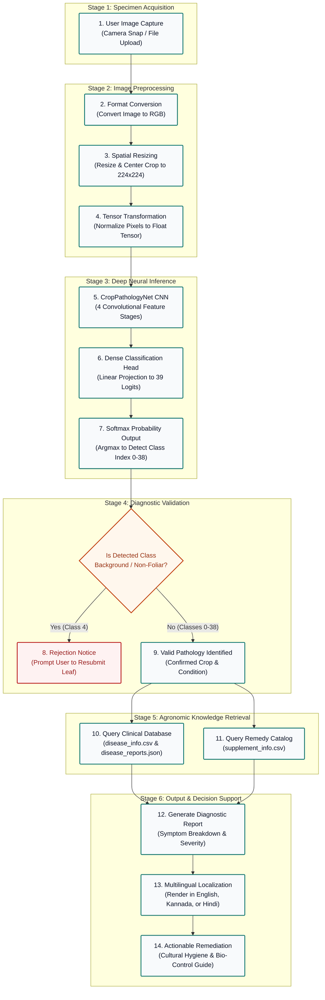

# FarmAssist: System Flowchart Specifications & Diagram Guide

This document provides a simple, clean, and effective flowchart representation of the **FarmAssist** plant pathology detection system. It is designed using simple rectangular/square boxes (no solid images) and contains all required data, labels, inputs, outputs, and connections to easily replicate the diagram in markdown, Draw.io, Lucidchart, Microsoft PowerPoint, or Visio.

---

## 1. Simple Flowchart Diagram (Mermaid)

The flowchart below uses standard rectangular boxes to trace a foliar image from field capture to localized agronomic treatment recommendations.



---

## 2. Text-Based Box Flowchart (ASCII Format)

For plain-text environments, technical papers, or terminals that do not render Mermaid:

```
+----------------------------------------------------------------+
|                 1. USER SPECIMEN ACQUISITION                   |
|       (Foliar Photo Upload or Live HTML5 Camera Capture)       |
+----------------------------------------------------------------+
                               |
                               v
+----------------------------------------------------------------+
|                   2. RGB FORMAT CONVERSION                     |
|           (Ensure 3-Channel RGB Color Representation)          |
+----------------------------------------------------------------+
                               |
                               v
+----------------------------------------------------------------+
|                   3. SPATIAL RESIZING                          |
|         (Resize Input to Standard 224 x 224 Pixels)            |
+----------------------------------------------------------------+
                               |
                               v
+----------------------------------------------------------------+
|                4. PYTORCH TENSOR NORMALIZATION                 |
|       (Scale Intensities [0, 1] & Batch Dimension (1,3,224,224))|
+----------------------------------------------------------------+
                               |
                               v
+----------------------------------------------------------------+
|             5. CROP-PATHOLOGY-NET FEATURE EXTRACTION           |
|      (4-Stage Convolutional Hierarchy with BatchNorm & ReLU)   |
+----------------------------------------------------------------+
                               |
                               v
+----------------------------------------------------------------+
|              6. DENSE CLASSIFICATION HEAD                      |
|       (Dropout Regularization + Linear Dense Projections)       |
+----------------------------------------------------------------+
                               |
                               v
+----------------------------------------------------------------+
|                7. SOFTMAX & ARGMAX EVALUATION                  |
|          (Compute Confidence Scores Across 39 Logits)          |
+----------------------------------------------------------------+
                               |
                               v
               /--------------------------------\
              <    Is Detected Class Class 4     >
              <     (Non-Foliar Background)?     >
               \--------------------------------/
                   /                        \
           [YES]  /                          \  [NO]
                 v                            v
+-----------------------------+  +-------------------------------+
|     8. REJECTION NOTICE     |  |   9. VALID PATHOLOGY DETECTED |
| (Display Prompt to Recapture|  | (Confirmed Condition from 38  |
| Clear Leaf Specimen)        |  |  Agricultural Target Classes) |
+-----------------------------+  +-------------------------------+
                                                 |
                                                 v
+----------------------------------------------------------------+
|              10. KNOWLEDGE BASE & CATALOG RETRIEVAL            |
|      - disease_info.csv    --> Clinical descriptions & causes  |
|      - supplement_info.csv --> Organic remedies & fungicides   |
|      - disease_reports.json--> Multilingual dossiers           |
+----------------------------------------------------------------+
                               |
                               v
+----------------------------------------------------------------+
|              11. MULTILINGUAL LOCALIZATION ENGINE              |
|        (Render Report in English, Kannada, or Hindi)           |
+----------------------------------------------------------------+
                               |
                               v
+----------------------------------------------------------------+
|               12. ACTIONABLE DIAGNOSTIC DOSSIER                |
|      - Confirmed Pathology & Confidence Score                  |
|      - Step-by-Step Cultural Field Hygiene (Pruning/Airflow)   |
|      - Target Biological Controls & Recommended Treatment      |
+----------------------------------------------------------------+
```

---

## 3. Node-by-Node Data Specification Table

Use the structured data below to populate custom boxes in diagram tools (Draw.io, Lucidchart, PowerPoint):

| Box ID | Step Title | Box Shape | Input Data | Processing Action | Output Data | Connected Next Step |
|:---:|:---|:---:|:---|:---|:---|:---:|
| **Box 1** | Specimen Capture | Rectangle | Raw image file or camera stream | User selects/snaps leaf photograph via browser UI | Raw Image Buffer (JPG/PNG) | **Box 2** |
| **Box 2** | Format Verification | Rectangle | Raw image buffer | Convert image mode to 3-channel RGB (`Image.convert('RGB')`) | Clean RGB Image | **Box 3** |
| **Box 3** | Spatial Resizing | Rectangle | RGB Image | Resize and center-crop to standard neural resolution | $224 \times 224 \times 3$ Pixels | **Box 4** |
| **Box 4** | Tensor Transformation | Rectangle | Resized RGB Image | Convert pixel values to PyTorch tensor; add batch dimension | Tensor shape: `(1, 3, 224, 224)` | **Box 5** |
| **Box 5** | Feature Extraction | Rectangle | `(1, 3, 224, 224)` Tensor | Forward pass through 4 Conv blocks (edges $\rightarrow$ textures $\rightarrow$ lesions) | Feature Map: `(1, 256, 14, 14)` | **Box 6** |
| **Box 6** | Dense Head | Rectangle | Flattened 50,176 vector | Pass through dropout ($p=0.4$) and fully connected layers | 39 Unnormalized Logits | **Box 7** |
| **Box 7** | Argmax Evaluation | Rectangle | 39 Logits | Compute Softmax probabilities; determine highest logit index | Predicted Class Index (0 to 38) | **Box 8** |
| **Box 8** | Background Validation | Diamond / Decision | Class Index | Check if predicted class equals 4 (`Background_without_leaves`) | Boolean condition | **Box 9** (No) / **Box 10** (Yes) |
| **Box 9** | Non-Foliar Rejection | Rectangle | Invalid condition | Notify user that image is not a recognized leaf specimen | Resubmission prompt | End (User re-uploads) |
| **Box 10** | Pathology Confirmation | Rectangle | Valid Class Index (0-38) | Match class index to agricultural condition registry | Verified Disease Identity | **Box 11** |
| **Box 11** | Knowledge Base Lookup | Rectangle | Disease Name & Index | Query `disease_info.csv`, `supplement_info.csv`, & `disease_reports.json` | Clinical Dossier & Remedies | **Box 12** |
| **Box 12** | Multilingual Translation | Rectangle | English Dossier + User Language | Translate diagnostic strings into selected language (EN / KN / HI) | Localized Report Content | **Box 13** |
| **Box 13** | Final Decision Report | Rectangle | Localized Dossier & Remedies | Render responsive results page with symptoms, cultural care, and products | Final User Diagnostic View | End of Flow |

---

## 4. Minimalist 5-Box Executive Summary Flowchart

For quick presentations or high-level slide decks, use this concise 5-step box chain:

```
+------------------+     +--------------------+     +---------------------+     +--------------------+     +---------------------+
| 1. CAPTURE LEAF  | --> | 2. PREPROCESS DATA | --> | 3. CNN INFERENCE    | --> | 4. MATCH PATHOLOGY | --> | 5. LOCALIZED REPORT |
| (Camera/Upload)  |     | (224x224 Tensor)   |     | (CropPathologyNet)  |     | (Clinical Catalog) |     | (Remedies & Guide)  |
+------------------+     +--------------------+     +---------------------+     +--------------------+     +---------------------+
```

---

## 5. How to Recreate This Flowchart in 2 Minutes

### Method A: Draw.io / Diagrams.net
1. Open [draw.io](https://app.diagrams.net/).
2. Select **Arrange** &rarr; **Insert** &rarr; **Advanced** &rarr; **Mermaid**.
3. Copy and paste the Mermaid code block from **Section 1** of this file.
4. Click **Insert**; the complete rectangular flowchart renders automatically.

### Method B: Microsoft PowerPoint / Google Slides
1. Insert **Rounded Rectangle** or **Rectangle** shapes for each of the 6 core stages.
2. Label each box using the titles from **Section 3**.
3. Connect the boxes using standard straight or elbow arrow connectors.
4. Use a consistent color theme (e.g., `#0f766e` Dark Teal for normal process boxes, `#c2410c` Orange for the background validation decision box).
