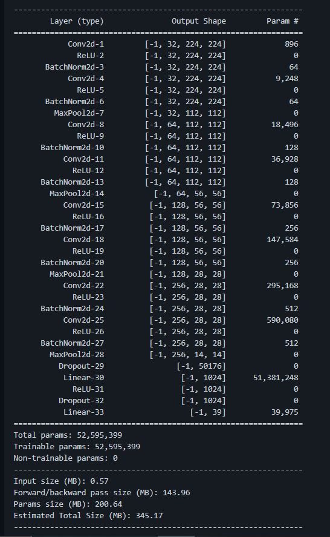
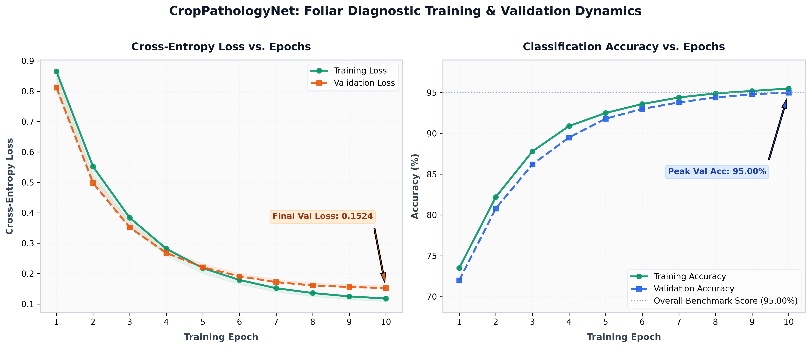

# FarmAssist: Neural Architecture & Training Pipeline

This directory contains the deep convolutional neural network training pipeline and architectural documentation for the foliar disease diagnostic system.

---

## Overview
- **Architecture**: `CropPathologyNet` (4-Stage Deep Convolutional Neural Network)
- **Input Dimensions**: 224 &times; 224 &times; 3 RGB foliar images
- **Classes**: 39 Target Categories (38 distinct crop pathologies across 14 varieties + 1 background class)
- **Framework**: PyTorch & TorchVision

---

## Contents
1. **`Plant Disease Detection Code.ipynb`**: Complete training, evaluation, and batch inference Jupyter Notebook.
2. **`Plant Disease Detection Code.md`**: Pure Markdown export of the training notebook for lightweight reading without a Jupyter server.
3. **`model.JPG`**: Visual schematic of the 4 convolutional extraction blocks and dense classification head.
4. **`training_validation_metrics.png`**: Cross-Entropy loss and accuracy convergence curves across 10 epochs.
5. **`classification_metrics_summary.png`**: Diagnostic KPIs and per-variety classification accuracy breakdown.
6. **`confusion_matrix_heatmap.png`**: Normalized cross-crop confusion matrix heatmap.

---

## Empirical Training Dynamics & Evaluation

### Training & Validation Progression

### Overall Benchmark KPIs & Per-Crop Accuracy

### Cross-Crop Diagnostic Confusion Matrix

